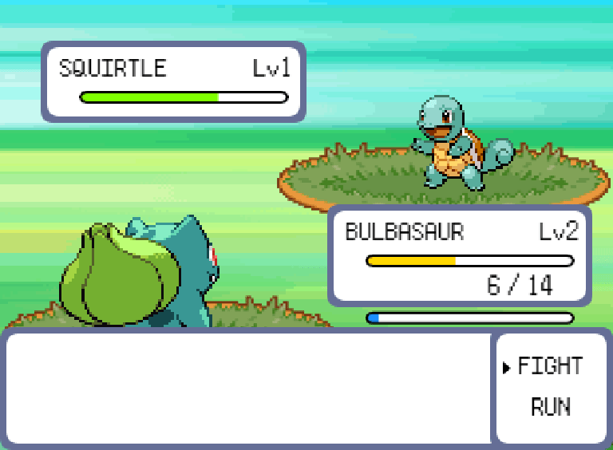
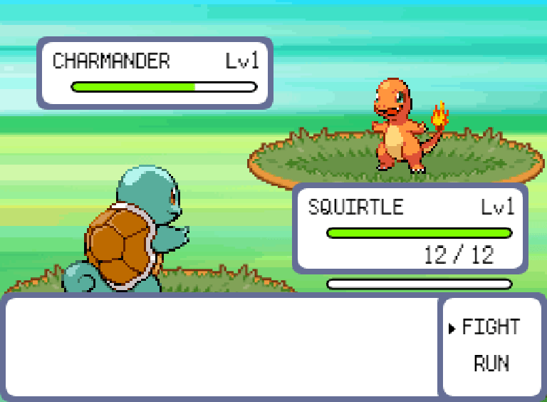

# Assignment 6 - Pokemon ⚡

- 💯**Worth**: 7%
- 📅**Due**: November 20, 2022 @ 23:59
- 🙅🏽‍**Penalty**: Late submissions lose 10% per day to a maximum of 3 days. Nothing is accepted after 3 days and a grade of 0% will be given.

## 🎯 Objectives

- Read and understand all of the Pokemon [notes](https://jac-cs-game-programming-fall22.github.io/Notes/#/6-Pokemon/) and [source code](https://github.com/JAC-CS-Game-Programming-Fall22/6-Pokemon) from Lecture 6.
- Implement a run feature that allows the player to exit a battle before their Pokemon faints.
- Implement a Menu that appears during the player Pokémon's level up that shows how much each state went up by.
- Implement health and experience progress bars for a sleeker looking UI.

## 🔍 Context

Welcome to your eighth (and final) assignment! This week's code is probably the most complicated we've looked at during the semester, but the assignment itself is fairly small in comparison. However, you will need to know how many of the pieces work and fit together in order to accomplish the task ahead.

### 🏃🏾‍♀️ Run

_The fade transition was making the GIF file size huge so I took it out temporarily while recording. The run functionality is the same regardless._

Implement a run feature that allows the player to exit a battle before their Pokemon faints.

> 💡 Hint: `BattleMenuState` is probably a good place to start!

### 🧮 Stat Menu

Implement a `Menu` that appears during the player Pokémon's level up that shows, for each stat, `X > Y`, where `X` is the old stat and `Y` is the new stat. This menu should appear right after the "Level Up" dialogue that appears at the end of a victory where the player has indeed leveled up.

> 💡 Hint: `BattleTurnState::processLevelUp()` is probably a good place to start!

### 🔄️ Progress Bars

Implement health and experience progress bars for a sleeker looking UI. See previous GIF for a visual. Your bars don't have to look exactly like mine, they just need to clearly indicate that health/experience values are being affected accordingly.

The health bars should deplete when either Pokémon takes damage in a battle.

- When their health is <= 100%, the bar should be **green**.
- When their health is <= 50%, the bar should be **yellow**.
- When their health is <= 25%, the bar should be **red**.
- The player Pokémon's health should still have the text indicator (ex. `4/12`) as well as the bar, whereas the opponent Pokémon's health should only have the bar.

When the player's Pokémon wins a battle, their experience bar should fill up based on the amount of experience they gained. The opponent Pokémon does not have an experience bar.

> 💡 Hint: Make a new UI element called `ProgressBar` where you can set a current value and maximum value. You can then render some rectangles using these initial values as the width of the rectangles. Instantiate `ProgressBar` objects inside `PlayerPanel` and `OpponentPanel`, render and update them as needed, and you should be good to go!

#### 💡 Work Smarter

- You're going to be starting the game over and over and over again, dozens of times. Instead of going through the title screen every time you refresh, make it so that you start in the play state from the outset.
- When testing a particular feature you're implementing, hardcode the parameters to work to your advantage.
  - For example, when working on the progress bars, set up your environment so that you always start in a battle right away instead of having to walk through grass every time to encounter a Pokemon.

Taking the time at the beginning to set up your game in a state that is conducive to testing will save you tons of time down the road - trust me! And this isn't just for game programming, this goes for any type of development you do. 😉

## 🌿 Git

You can use either the Git CLI or you can also use VSC's built-in Git GUI client.

### 🖱️ GUI

1. In VSC, click on the third icon down in the left navigation bar to see a list of files that have changed and are ready to be staged.
2. Hover over where it says _Changes_ (right below the commit textbox) and click `+` to stage all the modified files to be committed. Alternatively, you can add specific files by clicking the `+` next to the individual file.
3. Type a commit message into the textbox and click the checkmark above it to commit all the files that were just staged.
4. Click `...` and then `push` to push the commit(s) up to GitHub.

### ⌨️ CLI

1. Run `git status` to see a list of files that have changed and are ready to be staged.
2. Run `git add .` to stage all the modified files to be committed. Alternatively, you can add specific files like this: `git add src/Pokemon.js`.
3. Run `git commit -m "A descriptive message here."` (including the quotes) to commit all the files that were just staged.
4. Run `git push` to push the commit(s) up to GitHub.

Regardless of the method you choose, it is very important that you commit frequently because:

- If you end up breaking your code, it is easy to revert back to a previous commit and start over.
- It provides a useful log of your work so that you (and your teammates if/when you're on a team) can keep track of the work that was done.

## 📥 Submission

> 💡 Note that the grading criteria can be found on Gradescope, but only after you've submitted. You're able to submit infinitely, so submit a blank repo first in order to reference the grading criteria while working on this assignment.

Once you've made your final `git push` to GitHub, here's what you have to do to submit:

1. Go to [Gradescope](https://www.gradescope.ca/courses/7664) and click the link for this assignment.
2. Select the correct repository and branch from the dropdown menus.
3. Click _Upload_.
4. Record a screencast, **not to exceed 5 minutes in length**, in which you demonstrate your game's functionality.
   - The video should be recorded and uploaded using Microsoft Stream. [Please watch this instructional video on how to do so](https://web.microsoftstream.com/video/62738103-211f-4ddd-bb4a-c594eddcfb0a?list=studio) (you'll have to log in with your JAC email and password).
     - In the instructional video I mention to toggle on the "share sound" option. I later realized that it might be hard to hear what you'll be saying if the game music is playing, so feel free to toggle off the "share sound" option if you find that it's hard to hear yourself over the music in the recording.
   - In your video's description, please timestamp where each of the following occurs in your gameplay demonstration:
     - The run feature.
     - The stat menu feature.
     - The progress bar feature (the different health bar colours and the experience bar going up).
   - Add your video to the correct Stream channel for this assignment. Instructions for this are in the video link above.
